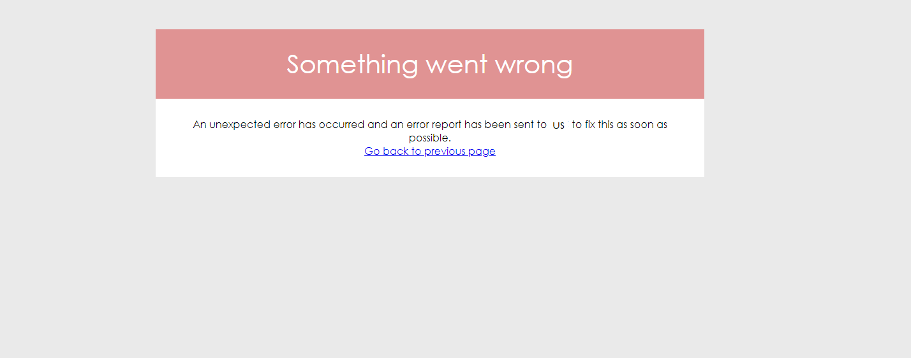

# LogTrackerBundle

Sometimes symfony does not display the exception in the browser, so you have to go to the log file and check the lastest log details so you can read the exception and locate the source of the problem.<br>
Pretty annoying isn't ? Well `LogtrackerBundle` will make your life easier by displaying the details of the log file (dev.log and prod.log) in more elegant way with the possibility of filtering and searching inside the file.<br>
`LogTrackerBunlde` helps you also to track any thrown exception in your project by sending real time email with the details of the exception.

# Installation

1. `composer require slimen/log-tracker`<br>
2. Enable the bundle in AppKernel.php `new SBC\LogTrackerBundle\LogTrackerBundle(),`<br>
3. Add this in `config/routing.yml`:<br>
    ```yaml
    log_trucker:
        resource: "@LogTrackerBundle/Resources/config/routing.yml"
        prefix:   /logger
    ```

# Usage
1. To display `dev.log` got to `localhost:/YourProject/web/dev_app.php/logger/_dev`
2. To display `prod.log` got to `localhost:/YourProject/web/dev_app.php/logger/_prod`
3. To keep track of thrown exception you need to add this in your `config.yml` file:<br>
    ```yaml
    # LogTracker Configuration
    log_tracker:
        app_name: 'Your app name'
        sender_mail: 'your_mail@company.com'
        # this option is removed in the version 1.2.0
        handler_text: 'Text will be displayed when LogTrackerBundle handle the error'
        recipients: ['mail1@company.com', 'mail2@company.com'] #you can add as much as you want of addresses
    ```
### How it works
In **production** mode `LogTrackerBundle` will catch any type of exception (except `NotFoundException` assuming that it will be handled to display **404 Not Found** page)
and will display this view (Of course unless you override it):<br><br>


### Update of the version 1.2.0
In this version you no longer need to add your custom text in the `config.yml` file
in the `handler_text` option instead you can override the whole view and display any
view you want by following [Symfony's override style](https://symfony.com/doc/3.4/templating/overriding.html)<br>
To override the view just add a view called `error_catcher.html.twig` under the folder
`app/Resources/LogTracker` and create the view you want to display for your users.

### License
This project is under the [MIT license](LICENSE)